[](#)
[](#)
[](LICENSE)

# 🔍 TruthLens — Summaries, Deep Dives & a 0–100 Truth Score

A founder-friendly toolkit to summarize YouTube videos and user-provided texts (e.g., book forewords), extract factual claims, gather sources, and compute a **0–100 Truth Score**—with a clean Markdown report you can share.

## 🔗 Table of Contents
- [Features](#features)
- [Folder Structure](#folder-structure)
- [Quickstart](#quickstart)
- [API Endpoints](#api-endpoints)
- [How Truth Scoring Works](#how-truth-scoring-works)
- [Legal & Ethics](#legal--ethics)
- [Architecture](#architecture)
- [Examples](#examples)
- [Roadmap](#roadmap)
- [License](#license)

## Features
- TL;DR & TL;DW (for videos with timestamps)
- Executive Summary (300–600 words) and Deep Dive
- Claim Extraction → Web Corroboration → **Truth Score (0–100)**
- “Critical-style” 1–5 ⭐ rating (clarity, evidence, bias)
- JSON + Markdown reports
- Optional Streamlit UI

## Folder Structure
```text
truthlens/
├─ app/
│  ├─ main.py
│  ├─ config.py
│  ├─ routers/
│  │  ├─ youtube.py
│  │  ├─ text.py
│  │  └─ web.py
│  ├─ services/
│  │  ├─ llm.py
│  │  ├─ transcript.py
│  │  ├─ summarizer.py
│  │  ├─ claim_extractor.py
│  │  ├─ searcher.py
│  │  ├─ fact_checker.py
│  │  └─ scoring.py
│  ├─ models/
│  │  └─ schemas.py
│  └─ utils/
│     ├─ logging.py
│     └─ rate_limit.py
├─ ui/
│  └─ app.py
├─ tests/
│  └─ test_scoring.py
├─ data/
│  └─ .gitkeep
├─ .env.example
├─ requirements.txt
├─ Makefile
├─ LICENSE
└─ README.md
````

## Quickstart

```bash
git clone https://github.com/emcdo411/truthlens-app.git
cd truthlens-app

python -m venv .venv
# Windows:
# .venv\Scripts\activate
# macOS/Linux:
# source .venv/bin/activate

pip install -r requirements.txt
cp .env.example .env   # add your API keys (LLM + search + YouTube)

# Run API
make run   # FastAPI at http://localhost:8000

# Optional UI
make ui    # Streamlit at http://localhost:8501
```

## API Endpoints

* `POST /analyze/youtube`
  **Body:** `{ "url": "https://youtu.be/..." }`

* `POST /analyze/text`
  **Body:** `{ "content": "your text" }`

* `POST /analyze/web`
  **Body:** `{ "url": "https://...", "extracted_text": "..." }`
  *Note:* Provide text you have the right to use. Do **not** scrape or republish copyrighted content.

## How Truth Scoring Works

1. Extract top factual claims with an LLM.
2. Search the web (Tavily/Serper/DDG) for **independent** corroboration.
3. For each claim, assess **support vs contradiction** from snippets.
4. Aggregate to a final **0–100 Truth Score** with a transparent rubric and trust weighting.

## Legal & Ethics

* Use official APIs where possible (e.g., YouTube Data API).
* Avoid scraping paywalled or copyrighted text (e.g., Amazon “Look Inside”).
* Whisper transcription is **local** and **opt-in** for personal research.
* Reports include links & short quotes/snippets under fair use (brief, attributed).

## Architecture

```mermaid
flowchart LR
  A["Input"] -->|"YouTube URL / Text / Web"| ING

  subgraph ING["Ingestion"]
    direction TB
    YT["YouTube transcript or captions"]
    TX["User-provided text"]
    WB["User-extracted web text"]
  end

  ING --> N["Normalize / Clean"]
  N --> SUM["Summarizer LLM"]
  N --> CLM["Claim Extractor LLM"]

  subgraph EVID["Evidence Search"]
    direction TB
    CLM --> QUE["Query Builder"]
    QUE --> SRCH["Search Provider (Tavily, Serper, DDG)"]
    SRCH --> SNIP["Top-N results + snippets"]
  end

  SNIP --> FACT["Fact Checker LLM"]
  FACT --> ASM["Per-claim assessment (support / contradiction / rationale)"]

  subgraph OUT["Scoring & Reports"]
    direction TB
    ASM --> SCORE["Truth scoring (0-100) + trust weighting"]
    SUM --> RPT["Report builder"]
    SCORE --> RPT
    ASM --> RPT
    RPT --> MD["Markdown"]
    RPT --> JSON["JSON"]
  end

```



## Examples

* **YouTube:** Provide a URL with a public transcript → get TL;DW, Summary, Deep Dive, Claims, Truth Score.
* **Books:** Paste your **own** foreword/excerpt text (or public domain text) → same pipeline.

## Roadmap

* Multi-provider LLM router
* PDF ingestion
* Per-claim confidence intervals

## License

DACR

```
Defensive AI Commercial Rights (DACR) License v1.0
SPDX-License-Identifier: LicenseRef-DACR-1.0

Copyright (c) 2025 Erwin Maurice McDonald

1. Definitions
   “Software” means this repository and its code, models, configs, and documentation.
   “Outputs” means content or artifacts produced by running the Software.
   “You” (or “Licensee”) means the individual or entity exercising rights under this License.
   “Foundation Model” means a large-scale model generally applicable across tasks.

2. Grant
   Subject to the Conditions and Restrictions below, the Licensor grants You a worldwide,
   royalty-free, non-exclusive license to use, copy, modify, create derivative works of,
   and distribute the Software and Outputs, including for commercial purposes.

3. Conditions (Attribution & Notices)
   a) Preserve all copyright notices and this License in copies or substantial portions of the Software.
   b) Clearly mark any modified files and state significant changes.
   c) If the Software generates reports that include third-party content, You are responsible
      for ensuring You have the right to use that content and for providing appropriate attribution.

4. Ethical Use Restrictions
   You must NOT use the Software or Outputs to:
   a) develop, deploy, or assist targeted or mass surveillance that violates privacy or civil liberties;
   b) enable unlawful discrimination or harassment; 
   c) produce or operationalize illegal disinformation campaigns or doxxing;
   d) develop or operate weapons, or systems intended to cause physical harm;
   e) violate applicable law, including data protection and export control laws.

5. Model Training / Competitive Use
   a) You may not use the Software or Outputs to train, fine-tune, or improve a Foundation Model
      (or a service exposing substantially similar core functionality) for the purpose of
      substituting or materially competing with the Software, unless:
        i) You obtain a separate commercial training license from the Licensor; or
       ii) any resulting model weights and code are released under this same DACR License.
   b) Using the Software to build narrow, non-substitutable features within a larger product is permitted.

6. Defensive Patent Termination
   If You (or any entity You control) initiate or join a patent claim alleging that the Software
   infringes a patent, Your license to the Software terminates automatically as of the date the claim is filed.

7. Compliance & Audit Trail (Lightweight)
   For deployments that produce factual analyses or scores, You must preserve an internal,
   non-public log of:
   a) data sources and citations used for claims assessment; and
   b) model/provider versions at time of scoring.
   Licensor may request a written certification of compliance (no access to Your data is required).

8. No Warranty
   THE SOFTWARE AND OUTPUTS ARE PROVIDED “AS IS”, WITHOUT WARRANTY OF ANY KIND,
   EXPRESS OR IMPLIED, INCLUDING BUT NOT LIMITED TO THE WARRANTIES OF MERCHANTABILITY,
   FITNESS FOR A PARTICULAR PURPOSE AND NON-INFRINGEMENT.

9. Limitation of Liability
   IN NO EVENT SHALL THE AUTHORS OR COPYRIGHT HOLDERS BE LIABLE FOR ANY CLAIM, DAMAGES
   OR OTHER LIABILITY, WHETHER IN AN ACTION OF CONTRACT, TORT OR OTHERWISE, ARISING FROM,
   OUT OF OR IN CONNECTION WITH THE SOFTWARE OR THE USE OR OTHER DEALINGS IN THE SOFTWARE.

10. Termination
   This License terminates automatically upon material breach. If You cure the breach within
   30 days of notice, rights may be reinstated at the Licensor’s discretion.

11. Miscellaneous
   This is the entire agreement for the Software. If any provision is unenforceable, the remainder remains in effect.

---


