[](#)
[](#)
[](LICENSE)

# 🔍 TruthLens — Summaries, Deep Dives & a 0–100 Truth Score

A founder-friendly toolkit to summarize YouTube videos and user-provided texts (e.g., book forewords), extract factual claims, gather sources, and compute a **0–100 Truth Score**—with a clean Markdown report you can share.

## 🔗 Table of Contents
- [Features](#features)
- [Folder Structure](#folder-structure)
- [Quickstart](#quickstart)
- [API Endpoints](#api-endpoints)
- [How Truth Scoring Works](#how-truth-scoring-works)
- [Legal & Ethics](#legal--ethics)
- [Architecture](#architecture)
- [Examples](#examples)
- [Roadmap](#roadmap)
- [License](#license)

## Features
- TL;DR & TL;DW (for videos with timestamps)
- Executive Summary (300–600 words) and Deep Dive
- Claim Extraction → Web Corroboration → **Truth Score (0–100)**
- “Critical-style” 1–5 ⭐ rating (clarity, evidence, bias)
- JSON + Markdown reports
- Optional Streamlit UI

## Folder Structure
```text
truthlens/
├─ app/
│  ├─ main.py
│  ├─ config.py
│  ├─ routers/
│  │  ├─ youtube.py
│  │  ├─ text.py
│  │  └─ web.py
│  ├─ services/
│  │  ├─ llm.py
│  │  ├─ transcript.py
│  │  ├─ summarizer.py
│  │  ├─ claim_extractor.py
│  │  ├─ searcher.py
│  │  ├─ fact_checker.py
│  │  └─ scoring.py
│  ├─ models/
│  │  └─ schemas.py
│  └─ utils/
│     ├─ logging.py
│     └─ rate_limit.py
├─ ui/
│  └─ app.py
├─ tests/
│  └─ test_scoring.py
├─ data/
│  └─ .gitkeep
├─ .env.example
├─ requirements.txt
├─ Makefile
├─ LICENSE
└─ README.md
````

## Quickstart

```bash
git clone https://github.com/emcdo411/truthlens-app.git
cd truthlens-app

python -m venv .venv
# Windows:
# .venv\Scripts\activate
# macOS/Linux:
# source .venv/bin/activate

pip install -r requirements.txt
cp .env.example .env   # add your API keys (LLM + search + YouTube)

# Run API
make run   # FastAPI at http://localhost:8000

# Optional UI
make ui    # Streamlit at http://localhost:8501
```

## API Endpoints

* `POST /analyze/youtube`
  **Body:** `{ "url": "https://youtu.be/..." }`

* `POST /analyze/text`
  **Body:** `{ "content": "your text" }`

* `POST /analyze/web`
  **Body:** `{ "url": "https://...", "extracted_text": "..." }`
  *Note:* Provide text you have the right to use. Do **not** scrape or republish copyrighted content.

## How Truth Scoring Works

1. Extract top factual claims with an LLM.
2. Search the web (Tavily/Serper/DDG) for **independent** corroboration.
3. For each claim, assess **support vs contradiction** from snippets.
4. Aggregate to a final **0–100 Truth Score** with a transparent rubric and trust weighting.

## Legal & Ethics

* Use official APIs where possible (e.g., YouTube Data API).
* Avoid scraping paywalled or copyrighted text (e.g., Amazon “Look Inside”).
* Whisper transcription is **local** and **opt-in** for personal research.
* Reports include links & short quotes/snippets under fair use (brief, attributed).

## Architecture

```mermaid
flowchart LR
  A["Input"] -->|"YouTube URL / Text / Web"| ING

  subgraph ING["Ingestion"]
    direction TB
    YT["YouTube transcript or captions"]
    TX["User-provided text"]
    WB["User-extracted web text"]
  end

  ING --> N["Normalize / Clean"]
  N --> SUM["Summarizer LLM"]
  N --> CLM["Claim Extractor LLM"]

  subgraph EVID["Evidence Search"]
    direction TB
    CLM --> QUE["Query Builder"]
    QUE --> SRCH["Search Provider (Tavily, Serper, DDG)"]
    SRCH --> SNIP["Top-N results + snippets"]
  end

  SNIP --> FACT["Fact Checker LLM"]
  FACT --> ASM["Per-claim assessment (support / contradiction / rationale)"]

  subgraph OUT["Scoring & Reports"]
    direction TB
    ASM --> SCORE["Truth scoring (0-100) + trust weighting"]
    SUM --> RPT["Report builder"]
    SCORE --> RPT
    ASM --> RPT
    RPT --> MD["Markdown"]
    RPT --> JSON["JSON"]
  end

```



## Examples

* **YouTube:** Provide a URL with a public transcript → get TL;DW, Summary, Deep Dive, Claims, Truth Score.
* **Books:** Paste your **own** foreword/excerpt text (or public domain text) → same pipeline.

## Roadmap

* Multi-provider LLM router
* PDF ingestion
* Per-claim confidence intervals

## License

MIT

```

---


